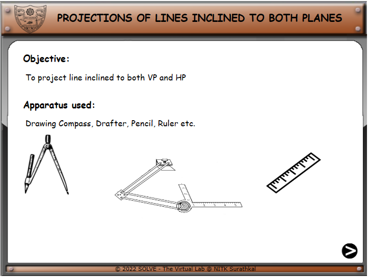
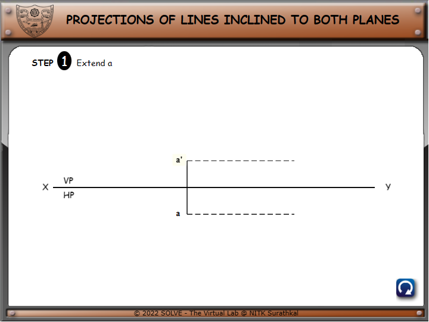
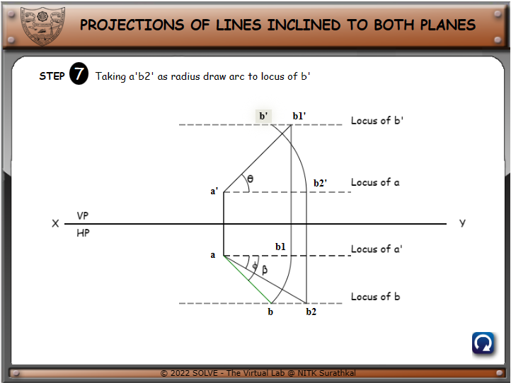
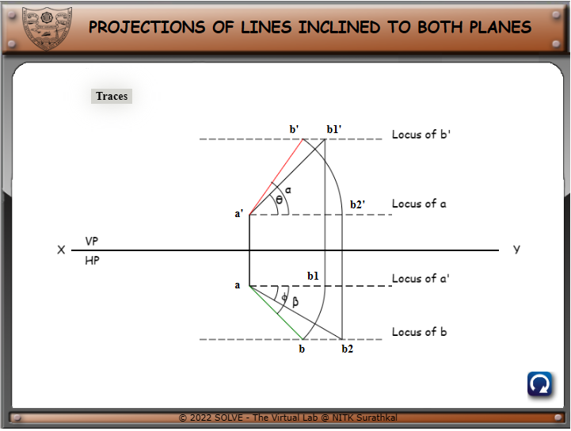
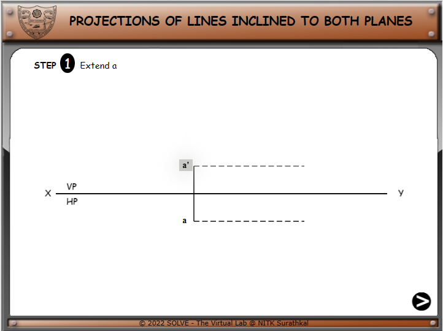
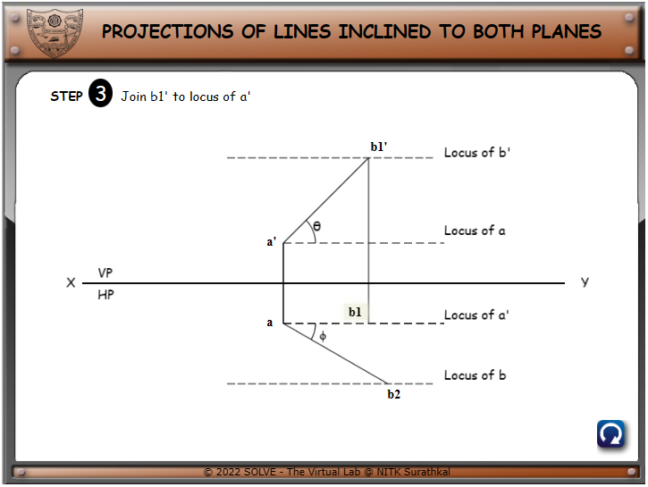

1)  .Click on **“Projection of Line”** the following window will open.
    Click on the **NEXT** button to proceed.

2)  .Click on **a’** for next step of construction. Follow the
    same.(**a’\<\<a\<\<b1’\<\<b1\<\<b\<\<b2\<\<b2’\<\<b’**)

3)  .After completion of the first part, click on **TRACES** for the
    next part.

4)  .Click on **h** next step to continue.Follow the same(**h\<\<v**).

5)  .Finally, the whole drawing is complete. And to again start with the
    initial step click on the **Reset** button.

